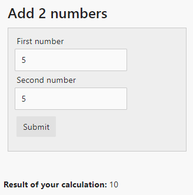

# UI Metadata Framework

UI Metadata Framework is a new way to build applications, which can *significantly* reduce the amount of effort required for building presentation layer. UI Metadata Framework is **client-server communication protocol, which allows client to generate user interfaces based on metadata provided by the server**. UI Metadata Framework's goals are

* to significantly reduce amount of effort required to develop application's UI
* to fully decouple client and server code and to enable development of general-purpose clients, which can generate UI for any server supporting UI Metadata Framework
* to allow application developers to target multiple platforms (web, android, ios, etc) with almost zero effort
* be language and platform agnostic

The core idea of UI Metadata Framework is that the server will send both data and metadata. The metadata will describe how to render that data.

The protocol has a couple of core concepts:

* Form - server-side function with metadata for its inputs and outputs.
* Form metadata - metadata for the *form*
* Form response - a combination of form's output (i.e. - data) and metadata describing how to process that output
* Input field - input parameter for the form. Form can have multiple input parameters, thus multiple input fields.
* Output field - output from the form. Form can have multiple output fields.
* Input field metadata - metadata describing how to render the input field.
* Output field metadata - metadata describing how to render the output field.
* Input field processor - a client-side function which can be invoked on a certain event.
* Response handler - a client-side function which accepts form response from server and presents it to the user in one way or another.

## Protocol implementation in .NET (UiMetadataFramework.Core)

`UiMetadataFramework.Core` library defines core concepts underlying the protocol. The library is implemented in .NET, however it can just as easily be implemented in any other programming language. 

This library also includes a **binding component**, which is basically a collection of .NET attributes that can be used to decorate a *form* with metadata. This later allows `MetadataBinder` class to collect *form's* metadata using .NET reflection.

## UiMetadataFramework.Basic

This library builds on top of `UiMetadataFramework.Core` to provide metadata for describing a set of standard UI components.

The library includes metadata implementation for these components:

### Input fields

* String
* Date
* Dropdown
* Number
* Password
* Boolean
* Paginator - a special input field to pass pagination parameters.
* Typeahead - allows specifying the data source for the typeahead control.
* MultiSelect - like `typeahead`, it allows developer to specify data source for the field.

### Output fields

* String
* DateTime
* Number
* FormLink - a link to any other form, which user can navigate.
* ActionList - collection of `FormLink`
* InlineForm - allows embedding one form inside another.
* Tabstrip - metadata for rendering tabs, each pointing to a separate form.
* PaginatedData - allows rendering data with pagination controls (must be used together with `Paginator` input field)
* TextValue - allows rendering any non-string value as string.

### Response handlers

* Message - should show a message to the user
* Redirect - should redirect user to another form
* Reload - should get new metadata from the server and reload the client

### Input processors

* BindToOutput - used for decorating input fields whose values should come from an output field.

## UiMetadataFramework.MediatR

This library marries the idea of UI Metadata Framework with [MediatR][mediatr]. MediatR provides an excellent way to structure your application as a collection of *request handlers*. Each *request handler* accepts a *request* and returns a *response*. This perfectly aligns with the concept of UI Metadata Framework where **form is a request handler, a collection of input fields is a request and a collection of output fields is a response**.

This library provides 2 main interfaces `IForm` and `IAsyncForm` which are basically MediatR's `IRequestHandler` and `IAsyncRequestHandler`. 

Using this library we can define a form like this:

```
[Form(Label = "Add 2 numbers")]
public class AddNumbers : IForm<AddNumbers.Request, AddNumbers.Response>
{
	public class Response : FormResponse
	{
		[OutputField(Label = "Result of your calculation")]
		public long Result { get; set; }
	}

	public class Request : IRequest<Response>
	{
		[InputField(Label = "First number")]
		public int Number1 { get; set; }

		[InputField(Label = "Second number")]
		public int Number2 { get; set; }
	}

	public Response Handle(Request message)
	{
		return new Response
		{
			Result = message.Number1 + message.Number2
		};
	}
}
```

`FormRegister` class with the help of `MetadataBinder` class, will then be able to retrieve metadata for the class above. The metadata will be sent to the client as a JSON object:

```
{
    "customProperties":null,
    "id":"UiMetadataFramework.Web.Forms.AddNumbers",
    "inputFields":[
        {
        "processors":[],
        "required":true,
        "id":"Number1",
        "label":"First number",
        "type":"number",
        "hidden":false,
        "orderIndex":0
        },
        {
        "processors":[],
        "required":true,
        "id":"Number2",
        "label":"Second number",
        "type":"number",
        "hidden":false,
        "orderIndex":0
        }
    ],
    "label":"Add 2 numbers",
    "outputFields":[
        {
        "id":"Result",
        "label":"Result of your calculation",
        "type":"number",
        "hidden":false,
        "orderIndex":0
        }
    ],
    "postOnLoad":false,
    "postOnLoadValidation":true
}
```

The result of which will be rendered as something like this:




## Server implementations

It's important to understand that **UI Metadata Framework is not a library, but a protocol**. As such it can have any number of implementations in any programming language. Currently there is only one implementation which is done in .NET Standard 1.6.

## Client implementations

The team is currently developing multiple clients:

* web client using [Svelte](svelte) - production-ready
* web client using [Vue](https://vuejs.org/) - work in progress
* web client using [Angular](https://angular.io/) - work in progress
* Android client using [Xamarin][xamarin] - work in progress
* IOS client using [Xamarin][xamarin] - work in progress

## How do I use this?

The easiest way to try UI Metadata Framework is to use the [uimf-app project template](https://github.com/niaher/uimf-app). The template uses ASP.NET Core 2 for server and [Svelte](svelte) for client implementation. Go check it out!

[mediatr]:https://github.com/jbogard/MediatR
[xamarin]:https://www.xamarin.com/
[svelte](https://svelte.technology/)
