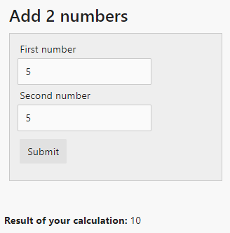

# UI Metadata Framework

UI Metadata Framework is a **client-server communication protocol**. It allows 
1) backend to generate metadata for its codebase and 
2) frontend to use that metadata to generate UI

The protocol has a couple of core concepts:

* Form - server-side function (i.e. - API endpoint) with metadata for its inputs and outputs.
* Input field - input parameter for the form. Form can have multiple input parameters, thus multiple input fields.
* Output field - output from the form. Form can have multiple output fields.

## Example usage

With UIMF we can write code like this:

```
[Form(Label = "Add 2 numbers", SubmitButtonLabel = "Submit", PostOnLoad = false)]
public class AddNumbers : IForm<AddNumbers.Request, AddNumbers.Response>
{
	public class Response : FormResponse
	{
		[OutputField(Label = "Result of your calculation")]
		public long Result { get; set; }
	}

	public class Request : IRequest<Response>
	{
		[InputField(Label = "First number")]
		public int Number1 { get; set; }

		[InputField(Label = "Second number")]
		public int Number2 { get; set; }
	}

	public Response Handle(Request message)
	{
		return new Response
		{
			Result = message.Number1 + message.Number2
		};
	}
}
```

UIMF will then use .NET reflection to generate metadata describing the form.

```
{
    "customProperties":null,
    "id":"UiMetadataFramework.Web.Forms.AddNumbers",
    "inputFields":[
        {
        "processors":[],
        "required":true,
        "id":"Number1",
        "label":"First number",
        "type":"number",
        "hidden":false,
        "orderIndex":0
        },
        {
        "processors":[],
        "required":true,
        "id":"Number2",
        "label":"Second number",
        "type":"number",
        "hidden":false,
        "orderIndex":0
        }
    ],
    "label":"Add 2 numbers",
    "outputFields":[
        {
        "id":"Result",
        "label":"Result of your calculation",
        "type":"number",
        "hidden":false,
        "orderIndex":0
        }
    ],
    "postOnLoad":false,
    "postOnLoadValidation":true
}
```

This metadata can be sent to the frontend as a JSON object. The frontend can then dynamically generate the UI.



## Codebase

The repository is organized into several libraries:

* `UiMetadataFramework.Core` - defines core concepts and building blocks. It can be used as to create your own UIMF backend and component library.
* `UiMetadataFramework.Basic` - demonstrates how to use `UiMetadataFramework.Core`. This library should be treated as an example only.

## Frontend implementations

* [uimf-svelte](https://github.com/unops/uimf-svelte) - web client built with [Svelte](svelte)

[svelte]:https://svelte.technology
